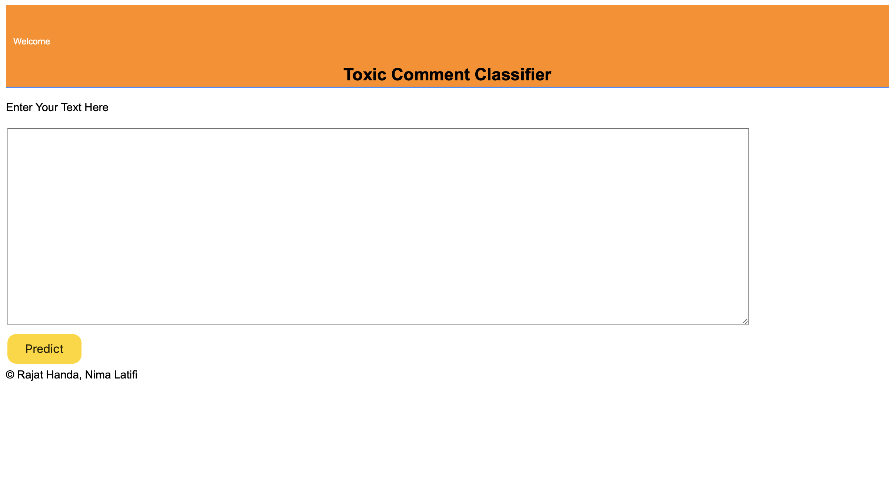

# Toxic-CommentClassification-Kaggle

## Introduction:
Discussing things you care about can be difficult. The threat of abuse and harassment online means that many people stop expressing themselves and give up on seeking different opinions. Platforms struggle to effectively facilitate conversations, leading many communities to limit or completely shut down user comments.

As a team of two, we implemented GRU and LSTM with different type of embeddings such as Word2Vec and GLOVE.

## Final Results:
We found out that GRU is 30% faster and is performing well w.r.t. LSTM.

## App Link:
Heroku App: https://kosherortoxic.herokuapp.com

